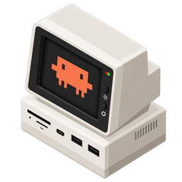
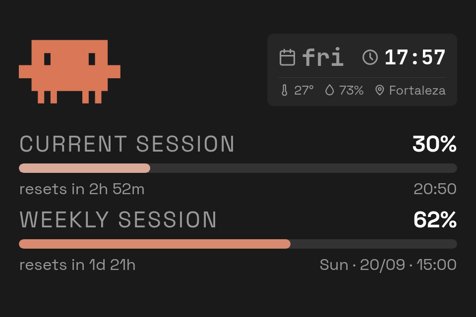
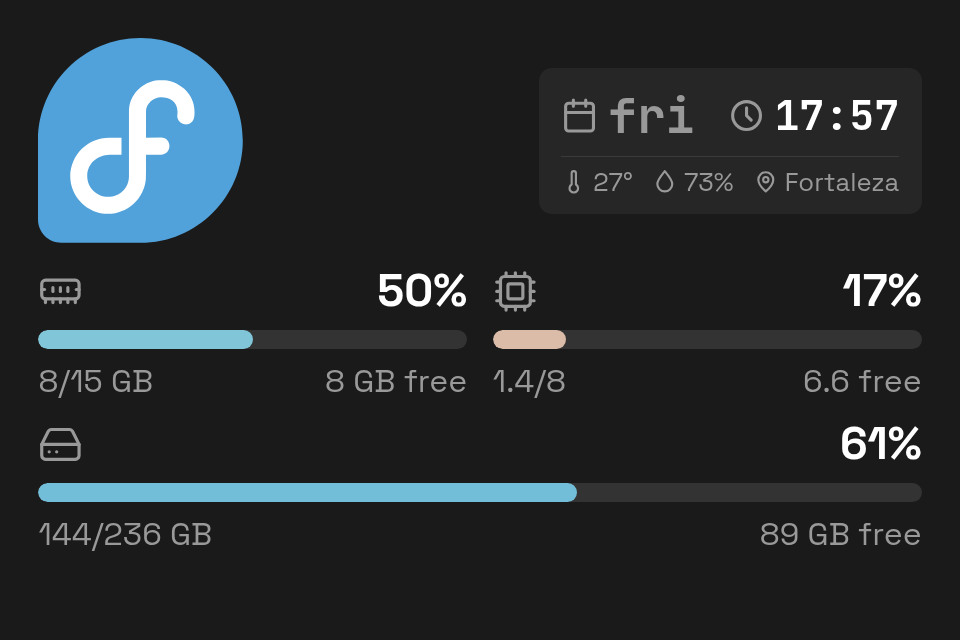

<p align="center">
  
</p>

<h1 align="center">claude-kiosk</h1>

<p align="center">
  <a href="https://pypi.org/project/claude-kiosk/"></a>
  <a href="https://omadson.github.io/claude-kiosk/"></a>
  <a href="https://pepy.tech/project/claude-kiosk"></a>
  <a href="https://github.com/omadson/claude-kiosk/blob/main/LICENSE"></a>
</p>

`claude-kiosk` is a local kiosk display for Claude usage and system resource stats. Shows two screens you tap/click to switch between:

- **Usage**: 5-hour and 7-day Claude usage bars (from the OAuth `usage` endpoint), plus a weather strip (day, time, temperature, humidity) up top.
- **Overview**: memory, CPU and disk usage bars for the host machine.

<p align="center">
  
  
</p>

It reads your existing Claude Code login from `~/.claude/.credentials.json` (no separate API key needed), and runs entirely locally: no telemetry, no external accounts.

## Quick start

Install with your tool of choice.

=== "uv"

    ```bash
    uv tool install claude-kiosk
    ```

=== "pipx"

    ```bash
    pipx install claude-kiosk
    ```

=== "pip"

    ```bash
    pip install claude-kiosk
    ```

Then run it: `serve` opens in your browser, `open` uses a dedicated
window with no address bar. See [Usage](usage.md) for the rest.

=== "browser"

    ```bash
    claude-kiosk serve
    ```

=== "dedicated window"

    ```bash
    claude-kiosk open
    ```

## License

`claude-kiosk` is [MIT licensed](https://github.com/omadson/claude-kiosk/blob/main/LICENSE).

## Where to go next

- [Installation](installation.md): `pip`/`pipx`/`uv tool`.
- [Usage](usage.md): every CLI command, configuration, and the desktop launcher integration.
- [Changelog](CHANGELOG.md): generated from commit history by `python-semantic-release`.
